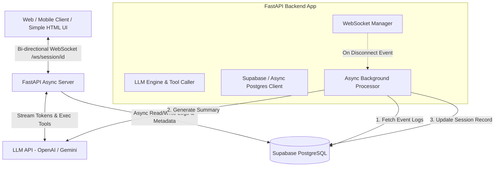
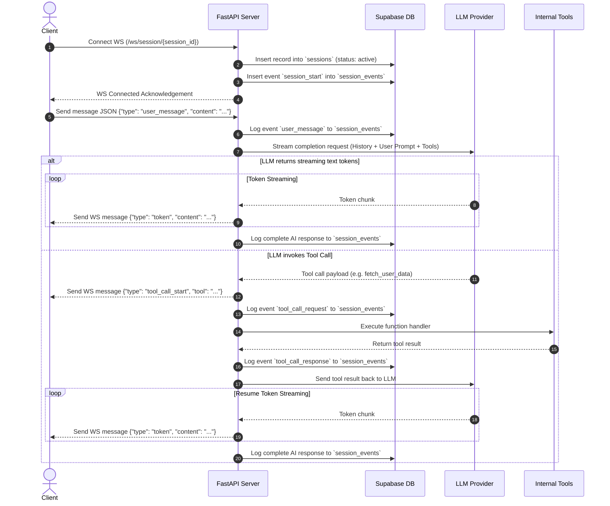
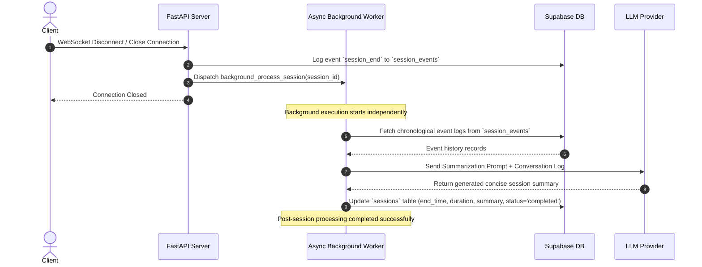

# Product Requirement Document (PRD)

## Project Name: Realtime AI Backend (WebSockets + Supabase)

---

## 1. Document Overview

### 1.1 Objective
The goal of this project is to build a high-performance, asynchronous Python backend service that manages real-time, bi-directional conversational sessions between users and an LLM. The system integrates real-time token streaming via WebSockets, complex LLM workflows (including tool/function calling and multi-step state management), asynchronous data persistence using Supabase (PostgreSQL), and automated post-session background processing (conversation summarization and metric finalization upon disconnect).

### 1.2 Target Audience
- **Backend Engineers & Evaluators**: Reviewing architecture, code quality, asynchronous patterns, and database design.
- **Frontend / Client Developers**: Integrating with the WebSocket protocol and event formats.

---

## 2. High-Level System Architecture



---

## 3. Core Requirements & Feature Specifications

### 3.1 Module 1: Realtime Session & Streaming
- **Framework**: Python 3.11+ using `FastAPI` (or `Quart`) with `uvicorn` as the ASGI server.
- **WebSocket Endpoint**: `/ws/session/{session_id}`
- **Session Lifecycle**:
  1. **Connection Initiation**: Client opens WebSocket connection with a `session_id` and optional `user_id`.
  2. **Session Bootstrap**: Server initializes session state, creates/verifies session record in Supabase `sessions` table.
  3. **Bi-directional Communication**:
     - Client sends JSON frames containing user messages or metadata.
     - Server processes prompt, streams back LLM response tokens in real-time JSON frames (`token`, `tool_call`, `status`, `error`).
  4. **Disconnect Handling**: On client disconnect, server handles clean termination and triggers post-session processing asynchronously without blocking socket closure.

### 3.2 Module 2: Complex LLM Interaction & Agentic Capabilities
Beyond basic prompt-response Q&A, the backend must support structured complex interaction patterns:
- **Function / Tool Calling**:
  - Register custom tools (e.g., `get_weather`, `fetch_user_account_info`, `search_knowledge_base`, `calculate_quote`).
  - When LLM signals a function call requirement, the backend intercepts the tool call request, executes the internal Python handler, logs the execution event, and feeds the result back to the LLM to resume streaming.
- **Multi-Step Routing & Context Control**:
  - Dynamically alter system prompts or instruction sets based on user query intent, session context, or metadata.
- **State Management**:
  - Maintain session history across turns in-memory (or rehydrated from event log) to maintain conversational context.

### 3.3 Module 3: Data Persistence (Supabase / Postgres)
All persistent state must be saved to a Supabase PostgreSQL instance using asynchronous database drivers (`supabase-py` / `httpx` / `asyncpg`).

#### Database Schema Design
1. **`sessions` Table** (Session Metadata):
   - `id`: UUID (Primary Key, default `gen_random_uuid()`)
   - `session_id`: TEXT (Unique identifier)
   - `user_id`: TEXT (Identifies user/client)
   - `start_time`: TIMESTAMPTZ (Session start time, default `now()`)
   - `end_time`: TIMESTAMPTZ (Nullable, updated on session end)
   - `duration_seconds`: FLOAT (Nullable, calculated duration)
   - `status`: TEXT (e.g., `active`, `completed`, `failed`)
   - `summary`: TEXT (Nullable, generated post-session summary)
   - `created_at`: TIMESTAMPTZ (default `now()`)

2. **`session_events` Table** (Detailed Event Log):
   - `id`: UUID (Primary Key, default `gen_random_uuid()`)
   - `session_id`: TEXT (Foreign Key referencing `sessions(session_id)`)
   - `event_type`: TEXT (e.g., `user_message`, `ai_response_chunk`, `ai_response_complete`, `tool_call_request`, `tool_call_response`, `session_start`, `session_end`)
   - `sender`: TEXT (e.g., `user`, `assistant`, `system`, `tool`)
   - `payload`: JSONB (Structured content of the event, including tokens, tool parameters, execution output)
   - `timestamp`: TIMESTAMPTZ (default `now()`)

### 3.4 Module 4: Post-Session Processing (Automation Pipeline)
Upon client disconnect (WebSocket connection drop or explicit disconnect signal):
1. **Trigger**: Server detects `WebSocketDisconnect` event.
2. **Background Task Dispatch**: Non-blocking asynchronous task (`asyncio.create_task` or FastAPI `BackgroundTasks`) is spawned.
3. **Log Aggregation**: Background worker queries `session_events` from Supabase for all events belonging to `session_id` ordered by `timestamp`.
4. **LLM Summarization**:
   - Compiles chronological conversation text.
   - Invokes LLM with a dedicated summarization prompt.
5. **Finalization & Database Sync**:
   - Calculates `duration_seconds` = `end_time` - `start_time`.
   - Updates `sessions` table record: sets `end_time`, `duration_seconds`, `summary`, and `status = 'completed'`.

### 3.5 Module 5: Test Client / Minimal Frontend UI
- A lightweight, single-file HTML/JS/CSS client (`index.html`) serving a UI with:
  - Session ID input / "Start Session" button.
  - Interactive chat window with real-time streaming display.
  - Visual indicators for tool execution and status.
  - Connection status badge (Connected / Streaming / Disconnected / Processing Summary).

---

## 4. Sequence Diagrams

### 4.1 Real-Time Streaming & Tool Execution Sequence



### 4.2 Post-Session Background Processing Sequence



---

## 5. Protocol Specification & Event Payloads

### 5.1 Client -> Server WebSocket Events

#### 1. User Message Event
```json
{
  "type": "message",
  "content": "What is the current status of my order #12345?"
}
```

#### 2. Ping / Heartbeat Event
```json
{
  "type": "ping"
}
```

---

### 5.2 Server -> Client WebSocket Events

#### 1. Token Stream Event
```json
{
  "type": "token",
  "content": "Your ",
  "session_id": "sess_98765"
}
```

#### 2. Tool Execution Notice Event
```json
{
  "type": "tool_call",
  "tool_name": "fetch_order_status",
  "status": "executing",
  "args": { "order_id": "12345" }
}
```

#### 3. Message Complete Event
```json
{
  "type": "message_complete",
  "full_response": "Your order #12345 is currently out for delivery.",
  "session_id": "sess_98765"
}
```

#### 4. Error Event
```json
{
  "type": "error",
  "message": "Failed to communicate with LLM provider.",
  "code": "LLM_PROVIDER_ERROR"
}
```

---

## 6. Database Schema (Supabase SQL / DDL)

```sql
-- Enable UUID extension if not already enabled
CREATE EXTENSION IF NOT EXISTS "uuid-ossp";

-- 1. Primary Table: Sessions Metadata
CREATE TABLE IF NOT EXISTS public.sessions (
    id UUID PRIMARY KEY DEFAULT gen_random_uuid(),
    session_id TEXT UNIQUE NOT NULL,
    user_id TEXT NOT NULL DEFAULT 'anonymous',
    start_time TIMESTAMPTZ NOT NULL DEFAULT NOW(),
    end_time TIMESTAMPTZ,
    duration_seconds DOUBLE PRECISION,
    status TEXT NOT NULL DEFAULT 'active',
    summary TEXT,
    created_at TIMESTAMPTZ NOT NULL DEFAULT NOW()
);

-- Index for session lookup
CREATE INDEX IF NOT EXISTS idx_sessions_session_id ON public.sessions(session_id);
CREATE INDEX IF NOT EXISTS idx_sessions_user_id ON public.sessions(user_id);

-- 2. Secondary Table: Detailed Event Log
CREATE TABLE IF NOT EXISTS public.session_events (
    id UUID PRIMARY KEY DEFAULT gen_random_uuid(),
    session_id TEXT NOT NULL REFERENCES public.sessions(session_id) ON DELETE CASCADE,
    event_type TEXT NOT NULL,
    sender TEXT NOT NULL,
    payload JSONB NOT NULL DEFAULT '{}'::jsonb,
    timestamp TIMESTAMPTZ NOT NULL DEFAULT NOW()
);

-- Index for timeline retrieval
CREATE INDEX IF NOT EXISTS idx_session_events_session_id_timestamp 
ON public.session_events(session_id, timestamp ASC);
```

---

## 7. Non-Functional Requirements (NFRs)

1. **Low Latency & High Concurrency**:
   - Asynchronous I/O (`asyncio`) across all network/DB boundaries.
   - Sub-100ms time-to-first-token (TTFT) overhead from backend routing.
2. **Reliability & Resilience**:
   - Connection drop recovery handling.
   - Robust exception handling in background tasks so failure to generate a summary never crashes the server.
3. **Data Integrity & Auditability**:
   - Granular event logging (every prompt, response token batch, tool call input/output recorded in Supabase).
4. **Security**:
   - Environment variables (`.env`) for storing API keys (`OPENAI_API_KEY`, `SUPABASE_URL`, `SUPABASE_KEY`).
   - Input sanitization on incoming WebSocket payload frames.

---

## 8. Deliverables Checklist

| Deliverable | Description | Location | Status |
| :--- | :--- | :--- | :--- |
| **Source Code** | FastAPI WebSockets server, LLM integration, Tool handlers, Supabase service, Post-session background processor | Repository `/` root | Pending |
| **Database Schema** | SQL migration file / commands for Supabase tables & indexes | `schema.sql` / README | Pending |
| **README.md** | Complete setup guide, dependency list, SQL commands, run & test instructions, design decisions | `README.md` | Pending |
| **Simple Frontend** | Single-page HTML/JS client to connect, send messages, observe streaming & tool executions | `static/index.html` or `frontend/` | Pending |
| **GitHub Repo** | Clean Git repository ready for submission | Git Repo Root | Pending |

---

## 9. Key Design Choices & Justifications

1. **FastAPI over Synchronous Frameworks**: FastAPI natively supports `asyncio` and WebSockets, making it optimal for streaming response tokens and concurrently logging events without blocking main worker threads.
2. **Postgres JSONB for Event Payloads**: Storing flexible event structures in `session_events.payload` using JSONB permits rich event logging (tool parameters, system state, token metrics) without requiring constant database schema alterations.
3. **Background Tasks for Post-Session Automation**: Offloading summarization and DB finalization to non-blocking background workers guarantees that WebSocket teardown is instantaneous for the client.
