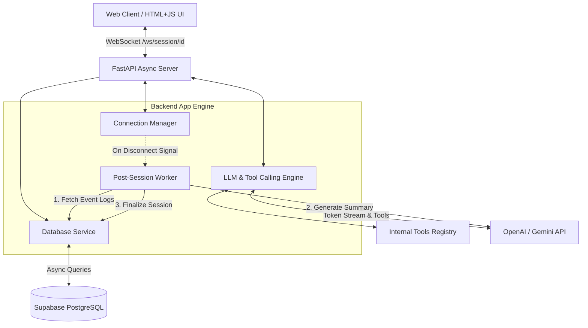

# Realtime AI Backend (WebSockets + Supabase)

High-performance, asynchronous Python backend service that simulates real-time conversational sessions with LLM token streaming over WebSockets, agentic function/tool calling, asynchronous data persistence with Supabase PostgreSQL, and automated post-session summarization.

---

##  Core Features

- **Bi-Directional Real-Time WebSockets**: Low-latency bi-directional communication via FastAPI WebSocket router (`/ws/session/{session_id}`).
- **LLM Token Streaming**: Stream response tokens word-by-word back to the client in real time.
- **Complex Interaction & Tool Calling**: Integrated tool calling engine executing internal Python functions (e.g. account details lookup, weather forecast, service quote calculator) and feeding results back into the LLM stream.
- **Supabase Persistence Layer**: Granular logging of all session metadata (`sessions`) and chronological event frames (`session_events`) using Supabase PostgreSQL.
- **Post-Session Automation**: Asynchronous background worker triggered on WebSocket client disconnect that compiles event logs, generates an LLM session summary, calculates active duration, and updates Supabase.
- **Lightweight Test UI**: Single-page dark glassmorphic HTML/JS web application (`static/index.html`) for interactive testing of streaming, tool execution, and session finalization.

---

##  System Architecture



---

##  Technology Stack & Dependencies

- **Runtime**: Python 3.11+ (`asyncio`)
- **Web Framework**: FastAPI `^0.110.0` with Uvicorn ASGI server
- **WebSockets**: Native WebSockets / `websockets`
- **Database**: Supabase PostgreSQL (via `supabase` async client & `httpx`)
- **AI Engine**: `openai` Async client (Function/Tool Calling + Streaming)
- **Settings & Environment**: `pydantic-settings` & `python-dotenv`

---

##  Quick Start & Setup Guide

### 1. Prerequisites
- Python 3.11+ installed.
- (Optional) Supabase project credentials & OpenAI API key.

### 2. Installation
Clone the repository and install required dependencies:

```bash
# Create virtual environment
python -m venv .venv

# Activate virtual environment
# Windows:
.\.venv\Scripts\activate
# Linux/macOS:
source .venv/bin/activate

# Install dependencies
pip install -r requirements.txt
```

### 3. Environment Configuration
Copy the template configuration file:

```bash
cp .env.example .env
```

Edit `.env` with your actual credentials:

```env
HOST=0.0.0.0
PORT=8000
ENVIRONMENT=development

# OpenAI API Key (Optional: system runs built-in streaming & tool mock engine if omitted)
OPENAI_API_KEY=your_openai_api_key_here
LLM_MODEL=gpt-4o-mini

# Supabase Credentials (Optional: system runs built-in in-memory fallback if omitted)
SUPABASE_URL=https://your-project.supabase.co
SUPABASE_KEY=your_supabase_anon_or_service_key
```

---

##  Supabase Database Schema (SQL Commands)

Execute the following SQL commands in your **Supabase SQL Editor** to create the required tables and indexes:

```sql
-- Enable UUID extension
CREATE EXTENSION IF NOT EXISTS "uuid-ossp";

-- 1. Primary Table: Sessions Metadata
CREATE TABLE IF NOT EXISTS public.sessions (
    id UUID PRIMARY KEY DEFAULT gen_random_uuid(),
    session_id TEXT UNIQUE NOT NULL,
    user_id TEXT NOT NULL DEFAULT 'anonymous',
    start_time TIMESTAMPTZ NOT NULL DEFAULT NOW(),
    end_time TIMESTAMPTZ,
    duration_seconds DOUBLE PRECISION,
    status TEXT NOT NULL DEFAULT 'active',
    summary TEXT,
    created_at TIMESTAMPTZ NOT NULL DEFAULT NOW()
);

-- Index for session lookups
CREATE INDEX IF NOT EXISTS idx_sessions_session_id ON public.sessions(session_id);
CREATE INDEX IF NOT EXISTS idx_sessions_user_id ON public.sessions(user_id);

-- 2. Secondary Table: Detailed Event Log
CREATE TABLE IF NOT EXISTS public.session_events (
    id UUID PRIMARY KEY DEFAULT gen_random_uuid(),
    session_id TEXT NOT NULL REFERENCES public.sessions(session_id) ON DELETE CASCADE,
    event_type TEXT NOT NULL,
    sender TEXT NOT NULL,
    payload JSONB NOT NULL DEFAULT '{}'::jsonb,
    timestamp TIMESTAMPTZ NOT NULL DEFAULT NOW()
);

-- Index for timeline retrieval
CREATE INDEX IF NOT EXISTS idx_session_events_session_id_timestamp 
ON public.session_events(session_id, timestamp ASC);

-- Row Level Security (RLS)
ALTER TABLE public.sessions ENABLE ROW LEVEL SECURITY;
ALTER TABLE public.session_events ENABLE ROW LEVEL SECURITY;

CREATE POLICY "Allow public read/write to sessions" ON public.sessions FOR ALL USING (true);
CREATE POLICY "Allow public read/write to session_events" ON public.session_events FOR ALL USING (true);
```

---

##  Running & Testing the WebSocket Server

### 1. Launch the Server
Start the server using `uvicorn`:

```bash
python main.py
```
*Or directly via uvicorn:*
```bash
uvicorn main:app --host 0.0.0.0 --port 8000 --reload
```

### 2. Interactive Web UI Testing
Open your browser and navigate to:
```
http://localhost:8000
```

1. Click **Connect Session**.
2. Try clicking preset tool call chips or type custom prompts:
   - *"Fetch account info for ACC-101"*
   - *"Check current weather in London"*
   - *"Calculate a quote for 40 hours of ai_consulting"*
3. Observe real-time token streaming, tool execution badges (`tool_executing`, `tool_completed`), and streaming completion.
4. Click **Disconnect & Summarize** to trigger the post-session automation. The UI will display the generated summary and active duration metrics.

---

## 📡 WebSocket Event Protocol Specification

### Endpoint: `/ws/session/{session_id}`

#### Client -> Server Frames
```json
{
  "type": "message",
  "content": "Fetch account info for ACC-101"
}
```

#### Server -> Client Frames

1. **System Connection**: `{"type": "system", "status": "connected", "session_id": "..."}`
2. **Stream Start**: `{"type": "stream_start", "session_id": "..."}`
3. **Token Frame**: `{"type": "token", "session_id": "...", "content": "..."}`
4. **Tool Execution Notice**: `{"type": "tool_executing", "tool_name": "...", "args": {...}}`
5. **Tool Result Completed**: `{"type": "tool_completed", "tool_name": "...", "result": {...}}`
6. **Stream Complete**: `{"type": "stream_complete", "session_id": "...", "full_response": "..."}`

---

##  Key Design Choices & Rationale

1. **FastAPI & Asyncio for Native WebSockets**: FastAPI provides native ASGI WebSocket support and integrates with Python's `asyncio` event loop for non-blocking I/O.
2. **Postgres JSONB for Granular Event Payloads**: Storing flexible event structures in `session_events.payload` using JSONB allows full audit logging of tool arguments, tokens, and system events without requiring constant table schema changes.
3. **Non-Blocking Background Summarization**: Triggering post-session summarization on `WebSocketDisconnect` via `asyncio.create_task` ensures socket teardown is immediate for the client while processing runs independently.
4. **Zero-Crash Fallback Architecture**: Built-in mock streaming and in-memory persistence allow local development and testing even when external database or API keys are not supplied.

---

##  Repository File Structure

```
Tecnvirons/
├── main.py                    # FastAPI server & WebSocket route definitions
├── config.py                  # Pydantic Settings & environment variable configuration
├── database.py                # Supabase async persistence layer & query functions
├── llm_service.py             # LLM streaming logic & tool calling loop
├── tools.py                   # Internal tool definitions & OpenAI function schemas
├── background.py              # Post-session summarization background worker
├── schema.sql                 # Supabase PostgreSQL DDL commands
├── requirements.txt           # Project dependencies
├── .env.example               # Template environment configuration file
├── PRD.md                     # Product Requirements Document
├── TRD.md                     # Technical Requirements Document
├── ROADMAP.md                 # 7-Phase Execution Plan
└── static/
    └── index.html             # Single-page WebSocket test client UI
```
