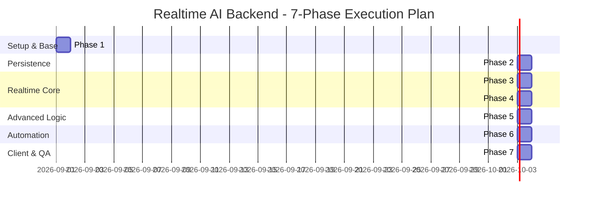

# Project Implementation Roadmap (7 Phases)

## Project Name: Realtime AI Backend (WebSockets + Supabase)

This document details the phased implementation roadmap for building the complete asynchronous Python backend system. Each phase is self-contained with clear technical deliverables, verification steps, and file changes. Execution will proceed step-by-step upon explicit user authorization.

---

---

## 📌 Phase Overview & Action Plan

### 🚀 Phase 1: Environment Setup & Project Foundation
- **Goal**: Initialize project directory, configure dependencies, setup Pydantic settings, and environment templates.
- **Tasks**:
  1. Create `requirements.txt` with dependencies (`fastapi`, `uvicorn`, `websockets`, `supabase`, `openai`, `pydantic-settings`, `python-dotenv`, `httpx`).
  2. Create `.env.example` and `.env` template for configuration (`OPENAI_API_KEY`, `SUPABASE_URL`, `SUPABASE_KEY`).
  3. Create `config.py` using Pydantic `BaseSettings` for strongly typed configuration management.
- **Files Created**: `requirements.txt`, `.env.example`, `config.py`
- **Verification**: Run dependency validation test and confirm configuration loading.

---

### 🗄️ Phase 2: Database Schema & Supabase Async Service Layer
- **Goal**: Provision Supabase tables and write async CRUD database service helper functions.
- **Tasks**:
  1. Create `schema.sql` containing DDL for `sessions` and `session_events` tables along with performance indexes.
  2. Create `database.py` with asynchronous database helper functions:
     - `create_session(session_id, user_id)`
     - `log_session_event(session_id, event_type, sender, payload)`
     - `get_session_events(session_id)`
     - `finalize_session(session_id, summary, duration_seconds)`
- **Files Created**: `schema.sql`, `database.py`
- **Verification**: Validate SQL schema syntax and test Supabase async connection and event logging functions.

---

### 🔌 Phase 3: WebSocket Connection Manager & Session Lifecycle
- **Goal**: Build the FastAPI ASGI server with a robust WebSocket manager for `/ws/session/{session_id}`.
- **Tasks**:
  1. Create `connection_manager.py` with `ConnectionManager` class to track active WebSocket connections per `session_id`.
  2. Implement main route `/ws/session/{session_id}` in `main.py`.
  3. Wire socket lifecycle events: on connect -> register session in Supabase; on message -> parse JSON frame; on disconnect -> handle teardown cleanly.
- **Files Created**: `connection_manager.py`, `main.py`
- **Verification**: Test WebSocket connection establishment and disconnect handling using Python client or `wscat`.

---

### ⚡ Phase 4: LLM Integration & Real-Time Token Streaming
- **Goal**: Connect OpenAI/Gemini async API and stream tokens back to WebSocket clients in real-time.
- **Tasks**:
  1. Create `llm_service.py` to manage LLM API calls using async streaming iterators.
  2. Stream tokens frame-by-frame (`type: "token"`) to WebSocket client while accumulating full response text.
  3. Log completed user message and assistant response to Supabase `session_events` table asynchronously.
- **Files Created**: `llm_service.py`
- **Verification**: Send test prompts and observe low-latency token streaming over WebSockets.

---

### 🛠️ Phase 5: Complex Interaction Engine (Function / Tool Calling & Routing)
- **Goal**: Implement function calling capabilities and multi-turn state management.
- **Tasks**:
  1. Create `tools.py` containing simulated internal functions (e.g., `fetch_user_account`, `get_weather_forecast`, `check_order_status`) and their OpenAI JSON schemas.
  2. Implement tool dispatcher in `llm_service.py` to detect function calls, send `tool_executing` and `tool_completed` frames to WebSocket, execute tool logic, and feed results back to LLM to resume streaming.
- **Files Created**: `tools.py` (Modify `llm_service.py`)
- **Verification**: Trigger prompts requiring single and multi-tool calls and verify complete execution loop.

---

### 🤖 Phase 6: Post-Session Processing & Automation Pipeline
- **Goal**: Automate post-session conversation analysis and summarization upon WebSocket disconnect.
- **Tasks**:
  1. Create `background.py` with `process_post_session(session_id)` background task function.
  2. Hook disconnect event in `main.py` to trigger background summarization task asynchronously via FastAPI `BackgroundTasks`.
  3. Fetch all event logs from Supabase, run LLM summarization prompt, calculate session duration, and update `sessions` table record (`summary`, `duration_seconds`, `end_time`, `status = 'completed'`).
- **Files Created**: `background.py` (Modify `main.py`)
- **Verification**: Connect, exchange messages, close WebSocket, and verify background task generates and stores summary in Supabase.

---

### 🎨 Phase 7: Test Frontend UI, Documentation & End-to-End Verification
- **Goal**: Provide a clean test client UI and complete project documentation.
- **Tasks**:
  1. Create `static/index.html` with Vanilla JS/CSS for a web interface to test WebSockets, prompt sending, token streaming display, and tool call status badges.
  2. Create comprehensive `README.md` covering setup instructions, Supabase SQL schema, running instructions, and architecture design explanations.
  3. Conduct end-to-end smoke test of all components.
- **Files Created**: `static/index.html`, `README.md`
- **Verification**: Complete walkthrough from browser connect -> tool execution -> streaming -> disconnect -> automated summary persistence.

---

## ⏸️ Execution Status

> **Status**: Waiting for user confirmation to start **Phase 1: Environment Setup & Project Foundation**.
