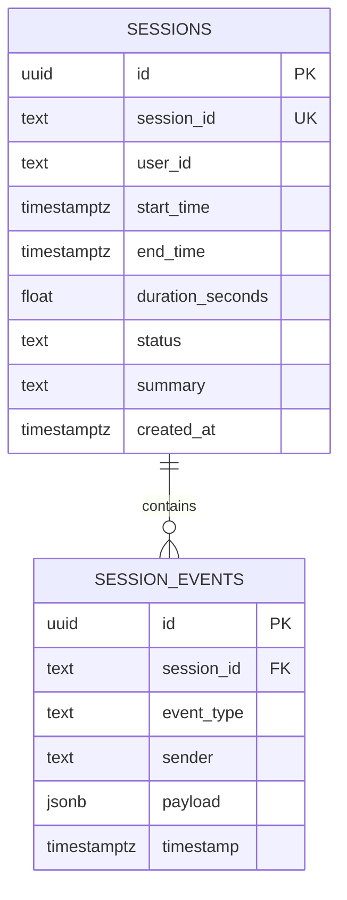

# Technical Requirements Document (TRD)

## Project Name: Realtime AI Backend (WebSockets + Supabase)

---

## 1. Executive Technical Summary

This Technical Requirements Document (TRD) outlines the low-level technical design, architecture, component specifications, data schemas, and implementation blueprints for the **Realtime AI Backend**. The system provides real-time, bi-directional audio/text-simulated streaming with LLM tool-calling capabilities over WebSockets, asynchronous session persistence via Supabase PostgreSQL, and automated post-session summarization triggered upon disconnect.

---

## 2. Technology Stack & Tech Specs

| Layer / Component | Technology Selected | Version / Details | Purpose |
| :--- | :--- | :--- | :--- |
| **Language** | Python | `3.11+` | Asynchronous core runtime (`asyncio`) |
| **Web Framework** | FastAPI | `^0.110.0` | High-performance ASGI framework with native WebSocket support |
| **ASGI Server** | Uvicorn | `^0.28.0` | Production ASGI HTTP & WebSocket server (`uvloop` optional) |
| **Database** | Supabase PostgreSQL | Managed Postgres | Relational data persistence with JSONB event logging |
| **DB Client** | `supabase-py` / `httpx` / `asyncpg` | Latest | Asynchronous PostgreSQL client & Supabase REST API |
| **LLM Provider** | OpenAI API / Google Gemini | `openai^1.14.0` or `google-genai` | Streaming response generation & Function/Tool Calling |
| **Data Validation** | Pydantic | `v2.x` | Strict type checking, payload parsing & validation |
| **Environment Mgmt** | `python-dotenv` | `^1.0.0` | Secure environment variable configuration |
| **Frontend UI** | HTML5 / JavaScript (Vanilla) | ES6 Native WebSockets | Lightweight client UI for testing streaming and tools |

---

## 3. Detailed Component Architecture

```mermaid
graph TD
    subgraph Client Layer
        UI[Simple Web Client / HTML+JS]
    end

    subgraph FastAPI Application Engine
        WS_Handler[WebSocket Router /ws/session/{session_id}]
        ConnMgr[Connection Manager]
        LLM_Engine[LLM Engine & Tool Dispatcher]
        DB_Service[Supabase Persistence Service]
        BG_Processor[Post-Session Summary Worker]
    end

    subgraph Internal Tools Registry
        Tool1[get_weather]
        Tool2[fetch_user_account]
        Tool3[calculate_quote]
    end

    subgraph External Services
        OpenAI_API[OpenAI / Gemini LLM Service]
        Supa_DB[(Supabase PostgreSQL)]
    end

    UI <-->|WebSocket JSON Stream| WS_Handler
    WS_Handler --> ConnMgr
    WS_Handler <--> LLM_Engine
    LLM_Engine <--> Tool1 & Tool2 & Tool3
    LLM_Engine <-->|Async Streaming| OpenAI_API
    WS_Handler --> DB_Service
    DB_Service <-->|Async Queries| Supa_DB
    
    ConnMgr -.->|On Disconnect Signal| BG_Processor
    BG_Processor --> DB_Service
    BG_Processor <--> OpenAI_API
```

---

## 4. Subsystem Detailed Designs

### 4.1 WebSocket Connection Manager (`ConnectionManager`)
- **Responsibilities**:
  - Accepts incoming WebSocket connection requests.
  - Maintains an active in-memory connection map: `dict[str, WebSocket]` mapping `session_id -> socket`.
  - Safe message sending wrapper methods: `send_json()`, `broadcast()`.
  - Clean client termination and disconnect handling.

### 4.2 LLM Streaming & Tool Calling Engine (`LLMEngine`)
- **Responsibilities**:
  - Manages conversation context buffer for active sessions.
  - Constructs tool definitions schema according to OpenAI Function Calling format.
  - Invokes `client.chat.completions.create(..., stream=True, tools=...)`.
  - Parses incoming chunks:
    - If `delta.content`: streams text tokens directly to client over WebSocket.
    - If `delta.tool_calls`: accumulates tool call parameters, executes registered Python tool handler, sends result back to LLM, and resumes token streaming.

### 4.3 Supabase Persistence Layer (`DatabaseService`)
- **Responsibilities**:
  - Initializes session record in `sessions` table upon WS connect (`status = 'active'`).
  - Asynchronously logs granular events to `session_events` table without blocking LLM stream response time (`asyncio.create_task`).
  - Retrieves complete session timeline history for post-session summarization.
  - Updates `sessions` table record on session teardown (`end_time`, `duration_seconds`, `summary`, `status = 'completed'`).

### 4.4 Post-Session Background Processor (`PostSessionProcessor`)
- **Responsibilities**:
  - Triggered via FastAPI `BackgroundTasks` or `asyncio.create_task` upon `WebSocketDisconnect`.
  - Queries all logged events for `session_id` ordered by `timestamp ASC`.
  - Formats conversation history into a structured prompt.
  - Invokes LLM in non-streaming mode to produce a concise summary.
  - Persists computed metrics back to `sessions` table in Supabase.

---

## 5. Database Schema & Technical DDL

### 5.1 Tables & Entity Relationship Diagram (ERD)



### 5.2 PostgreSQL DDL Scripts (`schema.sql`)

```sql
-- Enable Extensions
CREATE EXTENSION IF NOT EXISTS "uuid-ossp";

-- Table 1: Sessions
CREATE TABLE IF NOT EXISTS public.sessions (
    id UUID PRIMARY KEY DEFAULT gen_random_uuid(),
    session_id TEXT UNIQUE NOT NULL,
    user_id TEXT NOT NULL DEFAULT 'anonymous',
    start_time TIMESTAMPTZ NOT NULL DEFAULT NOW(),
    end_time TIMESTAMPTZ,
    duration_seconds DOUBLE PRECISION,
    status TEXT NOT NULL DEFAULT 'active',
    summary TEXT,
    created_at TIMESTAMPTZ NOT NULL DEFAULT NOW()
);

-- Table 2: Detailed Event Log
CREATE TABLE IF NOT EXISTS public.session_events (
    id UUID PRIMARY KEY DEFAULT gen_random_uuid(),
    session_id TEXT NOT NULL REFERENCES public.sessions(session_id) ON DELETE CASCADE,
    event_type TEXT NOT NULL,
    sender TEXT NOT NULL,
    payload JSONB NOT NULL DEFAULT '{}'::jsonb,
    timestamp TIMESTAMPTZ NOT NULL DEFAULT NOW()
);

-- Performance Indexes
CREATE INDEX IF NOT EXISTS idx_sessions_session_id ON public.sessions(session_id);
CREATE INDEX IF NOT EXISTS idx_session_events_session_id_timestamp 
ON public.session_events(session_id, timestamp ASC);
```

---

## 6. API & Protocol Technical Specifications

### 6.1 WebSocket Endpoint: `/ws/session/{session_id}`

#### Client to Server Payloads
1. **User Message Payload**:
   ```json
   {
     "type": "user_message",
     "content": "Can you check account balance for ACC-9982 and forecast weather for NYC?"
   }
   ```

2. **Ping / Heartbeat Payload**:
   ```json
   {
     "type": "ping"
   }
   ```

#### Server to Client Payloads
1. **Connection Established**:
   ```json
   {
     "type": "system",
     "status": "connected",
     "session_id": "sess_001",
     "timestamp": "2026-09-01T09:15:00Z"
   }
   ```

2. **LLM Token Stream Frame**:
   ```json
   {
     "type": "token",
     "session_id": "sess_001",
     "content": "Checking "
   }
   ```

3. **Tool Execution Frame**:
   ```json
   {
     "type": "tool_executing",
     "tool_name": "fetch_user_account",
     "args": { "account_id": "ACC-9982" }
   }
   ```

4. **Tool Result Notification Frame**:
   ```json
   {
     "type": "tool_completed",
     "tool_name": "fetch_user_account",
     "result": { "account_id": "ACC-9982", "balance": "$4,250.00", "status": "Active" }
   }
   ```

5. **Response Complete Frame**:
   ```json
   {
     "type": "message_complete",
     "session_id": "sess_001"
   }
   ```

6. **Pong Frame**:
   ```json
   {
     "type": "pong"
   }
   ```

---

## 7. Project File Structure & Implementation Blueprint

```
Tecnvirons/
│
├── main.py                    # FastAPI application entrypoint & WS route definitions
├── config.py                  # Pydantic Settings & environment variable configuration
├── database.py                # Supabase DB client & query helper functions
├── llm_service.py             # LLM streaming logic, tool registration & execution loop
├── tools.py                   # Internal tool definitions (simulated API functions)
├── background.py              # Post-session processing & summarization worker
├── schema.sql                 # Supabase PostgreSQL DDL migration file
├── requirements.txt           # Python dependencies
├── .env.example               # Template environment configuration file
├── PRD.md                     # Product Requirements Document
├── TRD.md                     # Technical Requirements Document
└── static/
    └── index.html             # Lightweight WebSocket test client UI
```

---

## 8. Error Handling & Edge Case Matrix

| Edge Case / Error | System Behavior | Technical Remediation |
| :--- | :--- | :--- |
| **Abrupt Client Disconnect** | `WebSocketDisconnect` raised during active streaming | Catch exception cleanly; flush open LLM stream; trigger background summarization task. |
| **Tool Execution Exception** | Tool handler throws Python exception | Catch exception; format tool result as `{"error": "Failed to run tool"}`; feed error back to LLM. |
| **Supabase DB Outage** | Database insert/query fails | Log error to server console; fallback to in-memory event buffer so WS session remains uninterrupted. |
| **LLM Rate Limit / Timeout** | Provider API returns 429/500 error | Catch exception; send `{"type": "error", "message": "Service busy"}` frame to WS client. |
| **Empty Session Disconnect** | Client disconnects without sending any message | Background processor checks event count; if 0 user messages, sets summary to `"No interaction occurred."` |

---

## 9. Verification & Testing Plan

### 9.1 Unit & Component Testing
- **WebSocket Route Tests**: Test connection establishment, ping-pong, and graceful teardown using FastAPI `TestClient.websocket_connect`.
- **Tool Handler Tests**: Unit test individual functions in `tools.py` for expected output structures.

### 9.2 End-to-End Functional Verification
1. Launch FastAPI server locally via `uvicorn main:app --reload`.
2. Open `static/index.html` in browser.
3. Click **Connect**, send a prompt requiring tool calls (e.g. *"Fetch account details for ACC-101 and check weather in London"*).
4. Verify token streaming display and tool execution logs in UI.
5. Close browser tab to disconnect WebSocket.
6. Verify in Supabase console:
   - `sessions` table updated with `end_time`, `duration_seconds`, `summary`, and `status = 'completed'`.
   - `session_events` table contains full chronological event logs.
